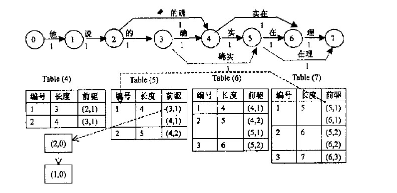
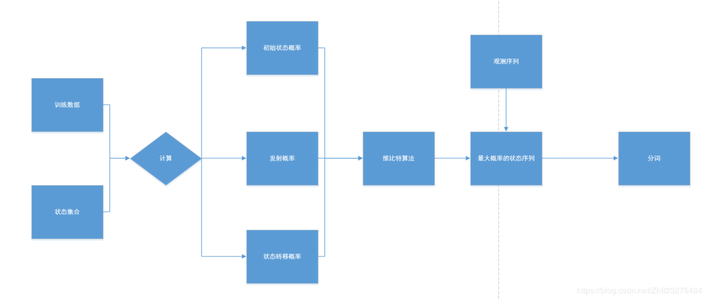
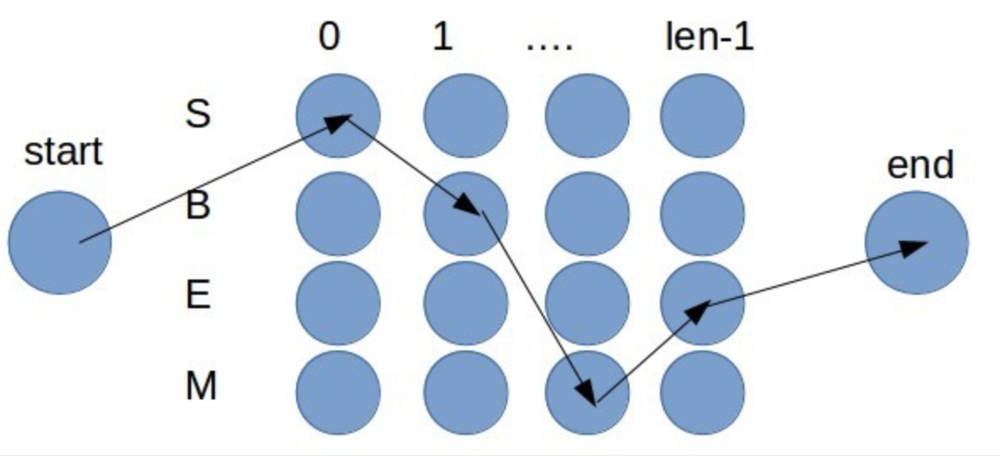
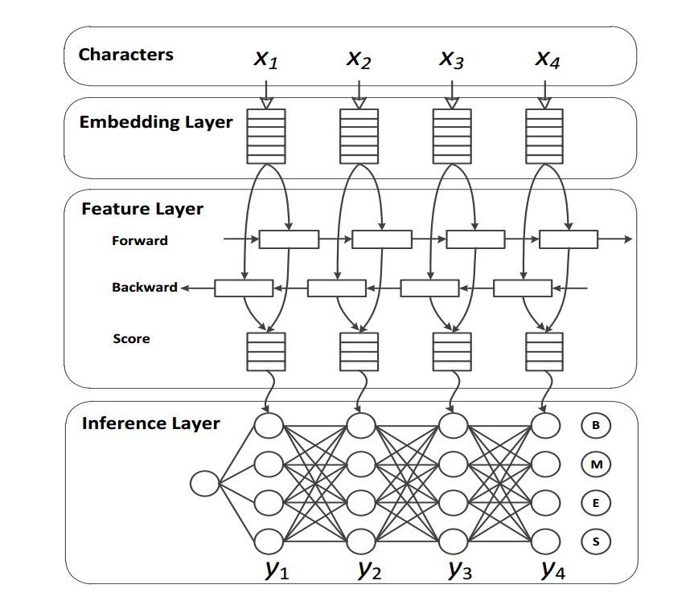
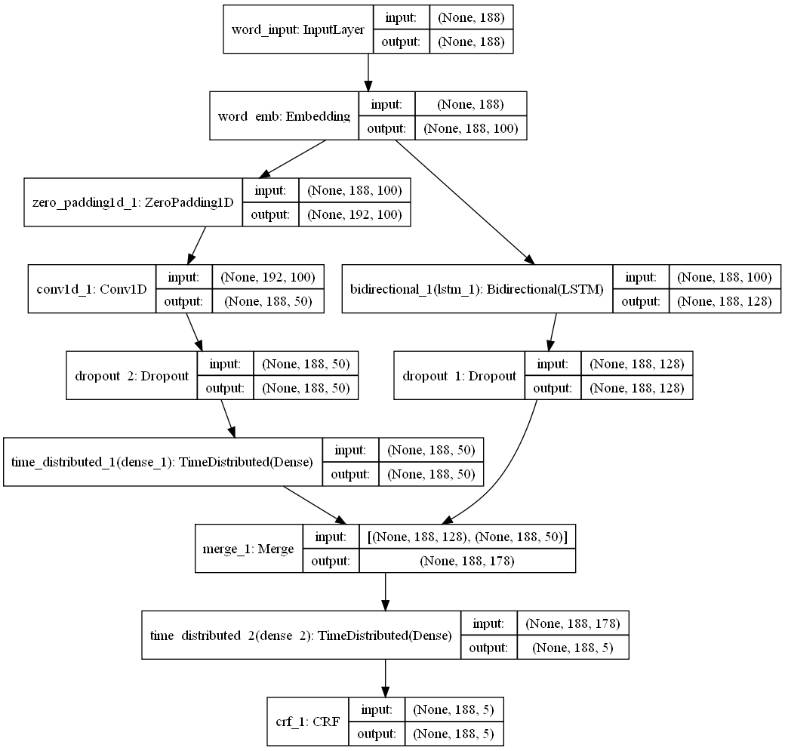

### 分词简介

中文分词算法是指将一个汉字序列切分成一个一个单独的词，与英文以空格作为天然的分隔符不同，中文字符在语义识别时，需要把数个字符组合成词，才能表达出真正的含义。分词算法通常应用于自然语言处理、搜索引擎、智能推荐等领域。

分词算法根据其核心思想主要分为两种，第一种是基于词典的分词，先把句子按照字典切分成词，再寻找词的最佳组合方式；第二种是基于字的分词，即由字构词，先把句子分成一个个字，再将字组合成词，寻找最优的切分策略，同时也可以转化成序列标注问题。

其分类大致可分为：

1. 基于匹配规则的方法
   * 正向最大匹配法(forward maximum matching method, FMM)
   * 逆向最大匹配法(backward maximum matching method, BMM)
   * 最短路径分词算法

2. 基于统计以及机器学习的分词方法
   * 基于N-gram语言模型的分词方法
   * 基于HMM的分词方法
   * 基于CRF的分词方法
   * 基于词感知机的分词方法
   * 基于深度学习的端到端的分词方法

基于规则匹配的分词通常会加入一些启发式规则，比如“正向/反向最大匹配”，“长词优先”等。

基于统计以及机器学习的分词方法，它们基于人工标注的词性和统计特征，对中文进行建模，即根据观测到的数据(标注好的语料)对模型参数进行训练，在分词阶段再通过模型计算各种分词出现的概率，将概率最大的分词结果作为最终结果。这类分词算法能很好处理歧义和未登录词问题，效果比基于规则匹配的方法效果好，但是需要大量的人工标注数据，以及较慢的分词速度。

[代码及数据](https://github.com/jeffery0628/chinese_word_seg)
如果存在公式乱码问题，请移步[github.io](https://jeffery0628.github.io/2020/04/28/%E5%88%86%E8%AF%8D%E7%AE%97%E6%B3%95/)

<!--more-->

#### 中文分词的应用

目前在自然语言处理技术中，中文处理技术比西文处理技术要落后很大一段距离，许多西文的处理方法中文不能直接采用，就是因为中文必需有分词这道工序。中文分词是其他中文信息处理的基础，搜索引擎只是中文分词的一个应用。其他的比如机器翻译（MT）、语音合成、自动分类、自动摘要、自动校对等等，都需要用到分词。因为中文需要分词，可能会影响一些研究，但同时也为一些企业带来机会，因为国外的计算机处理技术要想进入中国市场，首先也是要解决中文分词问题。在中文研究方面，相比外国人来说，中国人有十分明显的优势。

分词准确性对搜索引擎来说十分重要，但如果分词速度太慢，即使准确性再高，对于搜索引擎来说也是不可用的，因为搜索引擎需要处理数以亿计的网页，如果分词耗用的时间过长，会严重影响搜索引擎内容更新的速度。因此对于搜索引擎来说，分词的准确性和速度，二者都需要达到很高的要求。目前研究中文分词的大多是科研院校，清华、北大、中科院、北京语言学院、东北大学、IBM研究院、微软中国研究院等都有自己的研究队伍，而真正专业研究中文分词的商业公司除了海量科技以外，几乎没有。

### 基于匹配规则的方法

主要是人工建立词库也叫做词典，通过词典匹配的方式对句子进行划分。其实现简单高效，但是对未登陆词很难进行处理。主要有前向最大匹配法，后向最大匹配法以及双向最大匹配法。

#### 前向最大匹配算法

前向最大匹配算法，是从待分词句子的左边向右边搜索，寻找词的最大匹配。规定一个词的最大长度，每次扫描的时候寻找当前开始的这个长度的词来和字典中的词匹配，如果没有找到，就缩短长度继续寻找，直到找到字典中的词或者成为单字。

##### 算法流程

1. 从前向后扫描字典，测试读入的子串是否在字典中
2. 如果存在，则从输入中删除掉该子串，重新按照规则取子串，重复1
3. 如果不存在于字典中，则从右向左减少子串长度，重复1

##### 分词实例：

比如说输入 “北京大学生前来应聘”，假设词典中最长的单词为 5 个（MAX_LENGTH）。

1. 第一轮：取子串 “北京大学生”，正向取词，如果匹配失败，**每次去掉匹配字段最后面的一个字** 
   “北京大学生”，扫描 5 字词典，没有匹配，子串长度减 1 变为“北京大学”
   “北京大学”，扫描 4 字词典，有匹配，输出“北京大学”，输入变为“生前来应聘”
2. 第二轮：取子串“生前来应聘” 
   “生前来应聘”，扫描 5 字词典，没有匹配，子串长度减 1 变为“生前来应”
   “生前来应”，扫描 4 字词典，没有匹配，子串长度减 1 变为“生前来”
   “生前来”，扫描 3 字词典，没有匹配，子串长度减 1 变为“生前”
   “生前”，扫描 2 字词典，有匹配，输出“生前”，输入变为“来应聘””
3. 第三轮：取子串“来应聘” 
   “来应聘”，扫描 3 字词典，没有匹配，子串长度减 1 变为“来应”
   “来应”，扫描 2 字词典，没有匹配，子串长度减 1 变为“来”
   颗粒度最小为 1，直接输出“来”，输入变为“应聘”
4. 第四轮：取子串“应聘” 
   “应聘”，扫描 2 字词典，有匹配，输出“应聘”，输入变为“”
   输入长度为0，扫描终止

##### [代码](https://github.com/jeffery0628/chinese_word_seg)

数据准备：词库

```python
def forward_max_match(sentence, window_size, word_dict):
    """
    前向最大匹配算法：
    （1）扫描字典，测试读入的子串是否在字典中
    （2）如果存在，则从输入中删除掉该子串，重新按照规则取子串，重复（1）
    （3）如果不存在于字典中，则从右向左减少子串长度，重复（1）

    :param sentence: 待分词的句子
    :param window_size: 词的最大长度
    :param word_dict: 词典
    :return:
    """
    seg_words = []  # 存放分词结果

    while sentence:
        for word_len in range(window_size, 0, -1):
            if sentence[:word_len] in word_dict:
                # 如果该词再字典中，将该词保存到分词结果中,并将其从句中切出来
                seg_words.append(sentence[:word_len])
                sentence = sentence[word_len:]
                break
        else:
            # 如果窗口中的词不在字典中，将第一个字切分出来
            seg_words.append(sentence[:word_len])
            sentence = sentence[word_len:]

    return '/'.join(seg_words)
```

#### 后向最大匹配算法

在词典中从句尾向句首进行扫描，尽可能地选择与词典中最长单词匹配的词作为目标分词，然后进行下一次匹配。

在实践中，逆向最大匹配算法性能优于正向最大匹配算法。 

##### 算法流程

1. 从后向前扫描字典，测试读入的子串是否在字典中
2. 如果存在，则从输入中删除掉该子串，重新按照规则取子串，重复1
3. 如果不存在于字典中，则从左向右减少子串长度，重复1

##### 分词实例

输入 “北京大学生前来应聘”，假设词典中最长的单词为 5 个（MAX_LENGTH）。

1. 第一轮：取子串 “生前来应聘”，逆向取词，如果匹配失败，**每次去掉匹配字段最前面的一个字** 
   “生前来应聘”，扫描 5 字词典，没有匹配，字串长度减 1 变为“前来应聘”
   “前来应聘”，扫描 4 字词典，没有匹配，字串长度减 1 变为“来应聘”
   “来应聘”，扫描 3 字词典，没有匹配，字串长度减 1 变为“应聘”
   “应聘”，扫描 2 字词典，有匹配，输出“应聘”，输入变为“大学生前来”
2. 第二轮：取子串“大学生前来” 
   “大学生前来”，扫描 5 字词典，没有匹配，字串长度减 1 变为“学生前来”
   “学生前来”，扫描 4 字词典，没有匹配，字串长度减 1 变为“生前来”
   “生前来”，扫描 3 字词典，没有匹配，字串长度减 1 变为“前来”
   “前来”，扫描 2 字词典，有匹配，输出“前来”，输入变为“北京大学生”
3. 第三轮：取子串“北京大学生” 
   “北京大学生”，扫描 5 字词典，没有匹配，字串长度减 1 变为“京大学生”
   “京大学生”，扫描 4 字词典，没有匹配，字串长度减 1 变为“大学生”
   “大学生”，扫描 3 字词典，有匹配，输出“大学生”，输入变为“北京”
4. 第四轮：取子串“北京” 
   “北京”，扫描 2 字词典，有匹配，输出“北京”，输入变为“”
   输入长度为0，扫描终止

##### [代码](https://github.com/jeffery0628/chinese_word_seg)

数据准备：词库

```python
def backward_max_match(sentence, window_size, word_dict):
    """
    后向最大匹配算法：
    （1）从后向前扫描字典，测试读入的子串是否在字典中
    （2）如果存在，则从输入中删除掉该子串，重新按照规则取子串，重复（1）
    （3）如果不存在于字典中，则从右向左减少子串长度，重复（1）

    :param sentence: 待分词的句子
    :param window_size: 词的最大长度
    :param word_dict: 词典
    :return:
    """
    seg_words = []
    while sentence:
        for word_len in range(window_size, 0, -1):  # 每次去掉匹配字段最前面的一个字

            if sentence[len(sentence) - word_len:] in word_dict:
                # 如果该词再字典中，将该词保存到分词结果中,并将其从句中切出来
                seg_words.append(sentence[len(sentence) - word_len:])
                sentence = sentence[:len(sentence) - word_len]
                break
        else:
            # 如果窗口中的词不在字典中，将最后一个字切分出来
            seg_words.append(sentence[-1:])
            sentence = sentence[:-1]
    seg_words.reverse()
    return '/'.join(seg_words)
```

#### 双向最大匹配法

因为同一个句子，在机械分词中经常会出现多种分词的组合，因此需要进行歧义消除，来得到最优的分词结果。

以很常见的MMSEG机械分词算法为例，MMSEG在搜索引擎Solr中经常使用到，是一种非常可靠高效的分词算法。MMSEG消除歧义的规则有四个，它在使用中依次用这四个规则进行过滤，直到只有一种结果或者第四个规则使用完毕。这个四个规则分别是：

1. 最大匹配。选择“词组长度最大的”那个词组，然后选择这个词组的第一个词，作为切分出的第一个词，如对于“中国人民万岁”，匹配结果分别为：

   * 中/国/人
   * 中国/人/民
   * 中国/人民/万岁
   * 中国人/民/万岁

    在这个例子“词组长度最长的”词组为后两个，因此选择了“中国人/民/万岁”中的“中国人”，或者“中国/人民/万岁”中的“中国”。

2. 最大平均词语长度。经过规则1过滤后，如果剩余的词组超过1个，那就选择平均词语长度最大的那个(平均词长=词组总字数/词语数量)。比如“生活水平”，可能得到如下词组：

   * 生/活水/平 (4/3=1.33)
   * 生活/水/平 (4/3=1.33)
   * 生活/水平 (4/2=2)

    根据此规则，就可以确定选择“生活/水平”这个词组

3. 词语长度的最小变化率。这个变化率一般可以由标准差来决定。比如对于“中国人民万岁”这个短语，可以计算：

   * 中国/人民/万岁(标准差=sqrt(((2-2)^2+(2-2)^2+(2-2^2))/3)=0)
   * 中国人/民/万岁(标准差=sqrt(((2-3)^2+(2-1)^2+(2-2)^2)/3)=0.8165)

    于是选择“中国/人民/万岁”这个词组。

4. 计算词组中的所有单字词词频的自然对数，然后将得到的值相加，取总和最大的词组。比如：

   * 设施/和服/务
   * 设施/和/服务

    这两个词组中分别有“务”和“和”这两个单字词，假设“务”作为单字词时候的频率是5，“和”作为单字词时候的频率是10，对5和10取自然对数，然后取最大值者，所以取“和”字所在的词组，即“设施/和/服务”。

在实际中根据需求，选择或制定相应的规则来改善分词的质量。

##### 算法流程

1. 比较正向最大匹配和逆向最大匹配结果
2. 如果分词数量结果不同，那么取分词数量较少的那个
3. 如果分词数量结果相同
   * 分词结果相同，可以返回任何一个
   * 分词结果不同，返回单字数比较少的那个

这种规则的出发点来自语言学上的启发：汉语中单字词的数量要远小于非单字词。因此，算法应当尽量减少结果中的单字，保留更多的完整词语。

##### 分词实例

正向匹配最终切分结果为：北京大学 / 生前 / 来 / 应聘，分词数量为 4，单字数为 1
逆向匹配最终切分结果为：”北京/ 大学生/ 前来 / 应聘，分词数量为 4，单字数为 0
逆向匹配单字数少，因此返回逆向匹配的结果。

##### [代码](https://github.com/jeffery0628/chinese_word_seg)

数据准备：词库

```python
def fb_max_match(sentence,window_size,word_dict):
    """
    1. 比较正向最大匹配和逆向最大匹配结果
    2. 如果分词数量结果不同，那么取分词数量较少的那个
    3. 如果分词数量结果相同
       * 分词结果相同，可以返回任何一个
       * 分词结果不同，返回单字数比较少的那个
    :param sentence: 待分词的句子
    :param window_size: 词的最大长度
    :param word_dict: 词典
    :return:
    """
    forward_seg = forward_max_match(sentence,window_size,word_dict)
    backward_seg = backward_max_match(sentence,window_size,word_dict)

    # 如果分词结果不同，返回词数较小的分词结果
    if len(forward_seg) != len(backward_seg):
        return forward_seg if len(forward_seg) < len(backward_seg) else backward_seg
    else:
        # 如果分词结果词数相同，优先考虑返回包含单个字符最少的分词结果
        forward_single_word_count = len([filter(lambda x:len(x) == 1,forward_seg)])
        backward_single_word_count = len([filter(lambda x:len(x) == 1,backward_seg)])
        if forward_single_word_count != backward_single_word_count:
            return forward_seg if forward_single_word_count < backward_single_word_count else backward_seg
        else:
            # 否则，返回任意结果
            return forward_seg
```

##### 缺点：

对歧义问题的解决有点弱


#### (N-)最短路径分词算法

##### 基本思想

首先基于词典对文本进行全切分(改编版最大匹配)；然后基于词语的临接关系构建一个有向图；使用模型(比如一阶马尔科夫模型)对图里的边加权；最后使用最短路径算法求，从句首到句末质量最高(比如概率最大)的路径，就得到了分词结果。

##### 举例

最短路径分词算法首先将一句话中的所有词匹配出来，构成词图（有向无环图DAG），之后寻找从起始点到终点的最短路径作为最佳组合方式，以“他说的确实在理”为例，给出对这句话的3-最短路：


1. 构建有向图：根据一个已有词典构造出的有向无环图（全切分，根据临接关系构建有向图）。它将字串分为单个的字，每个字用图中相邻的两个结点表示，故对于长度为n的字串，需要n+1个结点。两节点间若有边，则表示两节点间所包含的所有结点构成的词，如图中结点2、3、4构成词“的确”。

2. 计算权重：本例子中权重为1（为了简单），实际应用中，可以使用一阶马尔科夫模型进行权重计算。

   * p(实，在)=p(实)*p(在|实)。概率取值越大，说明一个边出现的概率越大，这条边会提升所在分句结果的概率，由于最后要计算最短路径，需要构造一个连接权重与分局结果质量成反比的指标，因此对概率取了倒：weight=1/p(实,在)

   * 这个概率可能非常小，得到的权重取值非常大。而我们后面在计算路径的长度时，会将若干个边的权重加起来，这时候有上溢出的可能性。避免上溢出的常用策略是取对数。：weight=log(1/p(实，在))。

   * 概率的估算：概率就用频率来估计，p(实) = （“实”字在语料中出现的次数）/（语料的总词数），

     p(在|实) = p(实在)/p(实)=(“实在”在语料中出现的次数)/(“实”在语料中出现的次数)

     


##### [代码（维特比）](https://github.com/jeffery0628/chinese_word_seg)

数据准备：1、词库，2、词语之间的条件概率（用来计算路径权重）

```python
    # 使用维特比算法求词图的最短路径
    def viterbi(self, word_graph):
        path_length_map = {}  # 用于存储所有的路径，后面的邻接词语所在位置，以及对应的长度
        word_graph = [[["<start>", 1]]] + word_graph + [[["<end>", -1]]]
        # 这是一种比较简单的数据结构
        path_length_map[("<start>",)] = [1, 0]  # start处，后面的临接词语在列表的1处，路径长度是0,。

        for i in range(1, len(word_graph)):
            distance_from_start2current = {}
            if len(word_graph[i]) == 0:
                continue
            for former_path in list(path_length_map.keys()):  # path_length_map内容一直在变，需要深拷贝key,也就是已经积累的所有路径
                # 取出已经积累的路径，后面的临接词语位置，以及路径的长度。
                [next_index_4_former_path, former_distance] = path_length_map[former_path]
                former_word = former_path[-1]
                later_path = list(former_path)
                if next_index_4_former_path == i:  # 如果这条路径的临接词语的位置就是当前索引
                    for current_word in word_graph[i]:  # 遍历词图数据中，这个位置上的所有换选词语，然后与former_path拼接新路径
                        current_word, next_index = current_word
                        new_path = tuple(later_path + [current_word])  # 只有int, string, tuple这种不可修改的数据类型可以hash，
                        # 也就是成为dict的key
                        # 计算新路径的长度
                        new_path_len = former_distance + self.word_distance.get((former_word, current_word), 100)

                        path_length_map[new_path] = [next_index, new_path_len]  # 存储新路径后面的临接词语，以及路径长度

                        # 维特比的部分。选择到达当前节点的路径中，最短的那一条
                        if current_word in distance_from_start2current:  # 如果已经有到达当前词语的路径，需要择优
                            if distance_from_start2current[current_word][1] > new_path_len:  # 如果当前新路径比已有的更短
                                distance_from_start2current[current_word] = [new_path, new_path_len]  # 用更短的路径数据覆盖原来的
                        else:
                            distance_from_start2current[current_word] = [new_path, new_path_len]  # 如果还没有这条路径，就记录它
        shortest_path = distance_from_start2current["<end>"][0]
        shortest_path = shortest_path[1:-1]
        return shortest_path
```


#### 缺点

1. 对歧义和新词的处理不是很好，对词典中未出现的词没法进行处理。
2. 分词效果取决于词典的质量。


### 基于统计以及机器学习的分词方法


#### 基于N-gram语言模型的分词方法


##### 简介

n-gram模型，称为N元模型，可用于定义字符串中的距离，也可用于中文的分词；该模型假设第n个词的出现只与前面n-1个词相关，与其他词都不相关，整个语句的概率就是各个词出现概率的乘积；而这些概率，利用语料，统计同时出现相关词的概率次数计算得到；常用的模型是Bi-gram和Tri-gram模型。
假设一个字符串s由m个词组成，因此我们需要计算出$p(w_1,w_2,\ldots,w_m)$的概率，根据概率论中的链式法则得到如下：
$$
p(w_1,w_2,\ldots,w_m) = p(w_1)*p(w_2|w_1)*p(w_3|w_2,w_1)\ldots p(w_m|w_{m-1},\ldots,w_2,w_1)=\prod_{i}{p(w_i|w_1,w_2,\ldots,w_{i-1})}
$$
那么下面的问题是如何计算上面每一个概率，比如$p(w_1,w_2,w_3,w_4,w_5)$，一种比较直观的计算就是计数然后用除法：
$$
p(w_5|w_1,w_2,w_3,w_4) = \frac{Count(w_1,w_2,w_3,w_4,w_5)}{Count(w_1,w_2,w_3,w_4)}
$$


直接计算这个概率的难度有点大：

1. 直接这样计算会导致参数空间过大。

   一个语言模型的参数就是所有的这些条件概率，试想按上面方式计算$p(w_5|w_1,w_2,w_3,w_4)$,这里$w_5$有词典大小取值的可能，记词典大小：$|V|$，则该模型的参数个数是$|V|^5$，而且这还不包含$P(w_4|w_1,w_2,w_3)$的个数，可以看到这样去计算条件概率会使语言模型参数个数过多而无法使用。

2. 数据稀疏严重。我的理解是像上面那样计数计算，比如计数分子$w_1,w_2,w_3,w_4,w_5$,在我们所能见的文本中出现的次数是很小的，这样计算的结果是过多的条件概率会等于0，因为我们根本没有看到足够的文本来统计！假设一个语料库中单词的数量为$|V|$个，一个句子由$n$个词组成，那么每个单词都可能有$|V|$个取值，那么由这些词组成的$n$元组合的数目为$|V|^n$种，也就是说，组合数会随着$n$的增加而呈现指数级别的增长，随着$n$的增加，语料数据库能够提供的数据是非常有限的，除非有海量的各种类型的语料数据，否则还有大量的$n$元组合都没有在语料库中出现过（即由$n$个单词所组成的一些句子根本就没出现过，可以理解为很多的$n$元组所组成的句子不能被人很好地理解）也就是说依据最大似然估计得到的概率将会是0，模型可能仅仅能够计算寥寥几个句子。怎么解决呢？

解决參数空间过大的问题。引入了马尔科夫假设：**随意一个词出现的概率只与它前面出现的有限的一个或者几个词有关。**假设第$w_i$个词语只与它前面的$n$个词语相关，这样我们就得到前面的条件概率计算简化如下
$$
p(w_i|w_{i-1},\ldots,w_2,w_1) \approx p(w_i|w_{i-1},\ldots,w_{i-n})\\
p(w_1,w_2,\ldots,w_m) \approx \prod_{i} p(w_i|w_{i-1},\ldots,w_{i-n})
$$

当n=1，即一元模型（Uni-gram）,即$w_i$与它前面的0个词相关，即$w_i$不与任何词相关，每一个词都是相互独立的：
$$
P\left(w_{1}, w_{2}, \cdots, w_{m}\right)=\prod_{i=1}^{m} P\left(w_{i}\right)
$$
当n=2，即二元模型（Bi-gram）,此时$w_i$与它前面1个词相关：
$$
P\left(w_{1}, w_{2}, \cdots, w_{m}\right)=\prod_{i=1}^{m} P\left(w_{i} | w_{i-1}\right)
$$
当n=3时，即三元模型（Tri-gram）,此时$w_i$与它前面2个词相关：
$$
P\left(w_{1}, w_{2}, \cdots, w_{m}\right)=\prod_{i=1}^{m} P\left(w_{i} | w_{i-2} w_{i-1}\right)
$$
一般来说，N元模型就是假设当前词的出现概率只与它前面的N-1个词有关。而这些概率参数都是可以通过大规模语料库来计算。**在实践中用的最多的就是bigram和trigram了，高于四元的用的非常少，由于训练它须要更庞大的语料，并且数据稀疏严重，时间复杂度高，精度却提高的不多。**

##### 参数估计

要计算出模型中的条件概率，这些条件概率也称为模型的参数，得到这些参数的过程称为训练。用最大似然性估计计算下面的条件概率：
$$
P\left(w_{i} | w_{i-1}\right)=\frac{c\left(w_{i-1}, w_{i}\right)}{c\left(w_{i-1}\right)}
$$
一元语言模型中：句子概率定义为：$P\left(s\right)=\prod_{i=1}^{m} P\left(w_{i}\right)$,这个式子成立的条件是有一个假设，就是条件无关假设，我们认为每个词都是条件无关的。这里的参数种类是一种 $P(w_n)$,但是参数实例有$|V|$个(V是词典大小),我们应该如何得到每个参数实例的值。用的是极大似然估计法。比如训练语料是:"星期五早晨，我特意起了个大早，为的就是看看早晨的天空。"那么我们的字典为：星 期 五 早 晨 ，我 特 意 起 了 个 大 早 为 的 就 是 看 天 空 。 22个不同词，每个词语的概率直接用极大似然估计法估计得到。如：p(星) = 1/27，p(期) = 1/27。于是需要存储学习得到的模型参数，一个向量，22维，每个维度保存着每个单词的概率值。当需要计算：p(我看看早晨的天空)=p(我)p(看)p(看)p(早)p(晨)p(的)p(天)p(空)=$\frac{1}{27}*\frac{1}{27}*\frac{1}{27}\ldots *\frac{1}{27}$，可以直接计算出来。于是只要将每句话拆开为每个单词然后用累积形式运算，这样就能算出每句话的概率。

二元语言模型中：为了计算对应的二元模型的参数，即$P(w_i | w_{i-1})$，要先计数即$c(w_{i-1},w_i)$，然后计数$c(w_{i-1})$,再用除法可得到这些条件概率.可以看到对于$c(w_{i-1},w_i)$来说，$w_{i-1}$有语料库词典大小（记作$|V|$）的可能取值，$w_i$也是，所以$c(w_{i-1},w_i)$要计算的个数有$|V|^2$。

$c(w_{i-1},w_i)$计数结果如下:

|         | i    | want | to   | eat  | chinese | food | lunch | english |
| ------- | ---- | ---- | ---- | ---- | ------- | ---- | ----- | ------- |
| i       | 5    | 827  | 0    | 9    | 0       | 0    | 0     | 2       |
| want    | 2    | 0    | 608  | 1    | 6       | 6    | 5     | 1       |
| to      | 2    | 0    | 4    | 686  | 2       | 0    | 6     | 211     |
| eat     | 0    | 0    | 2    | 0    | 16      | 2    | 42    | 0       |
| chinese | 1    | 0    | 0    | 0    | 0       | 82   | 1     | 0       |
| food    | 15   | 0    | 15   | 0    | 1       | 4    | 0     | 0       |
| lunch   | 2    | 0    | 0    | 0    | 0       | 1    | 0     | 0       |
| spend   | 1    | 0    | 1    | 0    | 0       | 0    | 0     | 0       |

$c(w_{i-1})$的计数如下：

| i    | want | to   | eat  | chinese | food | lunch | english |
| ---- | ---- | ---- | ---- | ------- | ---- | ----- | ------- |
| 2533 | 927  | 2417 | 746  | 158     | 1093 | 341   | 278     |

那么二元模型的参数计算结果如下：


|         | i       | want | to     | eat    | chinese | food   | lunch  | english |
| ------- | ------- | ---- | ------ | ------ | ------- | ------ | ------ | ------- |
| i       | 0.002   | 0.33 | 0      | 0.0036 | 0       | 0      | 0      | 0.00079 |
| want    | 0.0022  | 0    | 0.66   | 0.0011 | 0.0065  | 0.0065 | 0.0054 | 0.0011  |
| to      | 0.00083 | 0    | 0.0017 | 0.28   | 0.00083 | 0      | 0.0025 | 0.087   |
| eat     | 0       | 0    | 0.0027 | 0      | 0.021   | 0.0027 | 0.056  | 0       |
| chinese | 0.0063  | 0    | 0      | 0      | 0       | 0.52   | 0.0063 | 0       |
| food    | 0.014   | 0    | 0.0014 | 0      | 0.00092 | 0.0037 | 0      | 0       |
| lunch   | 0.0059  | 0    | 0      | 0      | 0       | 0.0029 | 0      | 0       |
| spend   | 0.0036  | 0    | 0.0036 | 0      | 0       | 0      | 0      | 0       |

比如计算其中的P(want | i) = 0.33如:$p(want|i) = \frac{c(i,want)}{c(i)}=\frac{827}{2533} \approx0.33$,针对这个语料库的二元模型建立好了后，可以计算目标，即一个句子的概率了，一个例子如下：

$p(s)=p(i want english food) = p(i|<start>)*p(want|i)*p(english|want)*p(food|english)*p(<end>|food) \approx 0.000031$

该二元模型所捕捉到的一些实际信息:

* $p(english|want) = 0.0011,p(chinese|want)=0.0065$,want chinese 的概率更高，这和真实世界情况相对应，因为chinese food 比 English food 更受欢迎。
* $p(to|want)=0.66$, want to 的概率很高，反映了语法特性
* $p(food|to)=0$ ，to food 概率为0，因为这种搭配不常见
* $p(want|spend)=0$, spend want 概率为0，因为这样违反了语法。

常常在对数空间里面计算概率，原因有两个：

1. 防止溢出，如果计算的句子很长，最后得到的结果将非常小，甚至会溢出，比如计算得到的概率是0.001，那么假设以10为底取对数的结果就是-3，这样就不会溢出。
2. 对数空间里面加法可以代替乘法，因为log(p1p2) = logp1 + logp2，而在计算机内部，显然加法比乘法执行更快！

##### [代码](https://github.com/jeffery0628/chinese_word_seg)

数据准备：unigram:(word, freq),bigram:(word1,word2,freq) 语料数据。

```python
import sys
import math
# global parameter
DELIMITER = " "  # 分词之后的分隔符


class DNASegment:
    def __init__(self):
        self.word1_dict_prob = {}  # 记录概率,1-gram
        self.word1_dict_count = {}  # 记录词频,1-gram
        self.word1_dict_count["<S>"] = 8310575403  # 开始的<S>的个数

        self.word2_dict_prob = {}  # 记录概率,2-gram
        self.word2_dict_count = {}  # 记录词频,2-gram

        self.gmax_word_length = 0
        self.all_freq = 0  # 所有词的词频总和,1-gram的

    # 估算未出现的词的概率,根据beautiful data里面的方法估算
    def get_unkonw_word_prob(self, word):
        return math.log(10. / (self.all_freq * 10 ** len(word)))

    # 获得片段的概率
    def get_word_prob(self, word):
        if word in self.word1_dict_prob:  # 如果字典包含这个词
            prob = self.word1_dict_prob[word]
        else:
            prob = self.get_unkonw_word_prob(word)
        return prob

    # 获得两个词的转移概率(bigram)
    def get_word_trans_prob(self, first_word, second_word):
        trans_word = first_word + " " + second_word
        # print trans_word
        if trans_word in self.word2_dict_count:
            trans_prob = \
                math.log(self.word2_dict_count[trans_word] / self.word1_dict_count[first_word])
        else:
            trans_prob = self.get_word_prob(second_word)
        return trans_prob

    # 寻找node的最佳前驱节点
    # 方法为寻找所有可能的前驱片段
    def get_best_pre_node(self, sequence, node, node_state_list):
        # 如果node比最大词长小，取的片段长度以node的长度为限
        max_seg_length = min([node, self.gmax_word_length])
        pre_node_list = []  # 前驱节点列表

        # 获得所有的前驱片段，并记录累加概率
        for segment_length in range(1, max_seg_length + 1):
            segment_start_node = node - segment_length
            segment = sequence[segment_start_node:node]  # 获取片段

            pre_node = segment_start_node  # 取该片段，则记录对应的前驱节点

            if pre_node == 0:
                # 如果前驱片段开始节点是序列的开始节点，
                # 则概率为<S>转移到当前词的概率
                # segment_prob = self.get_word_prob(segment)
                segment_prob = self.get_word_trans_prob("<S>", segment)
            else:
                # 如果不是序列开始节点，按照二元概率计算
                # 获得前驱片段的前一个词
                pre_pre_node = node_state_list[pre_node]["pre_node"]
                pre_pre_word = sequence[pre_pre_node:pre_node]
                segment_prob = self.get_word_trans_prob(pre_pre_word, segment)

            pre_node_prob_sum = node_state_list[pre_node]["prob_sum"]  # 前驱节点的概率的累加值

            # 当前node一个候选的累加概率值
            candidate_prob_sum = pre_node_prob_sum + segment_prob

            pre_node_list.append((pre_node, candidate_prob_sum))

        # 找到最大的候选概率值
        (best_pre_node, best_prob_sum) = max(pre_node_list, key=lambda d: d[1])
        return (best_pre_node, best_prob_sum)

        # 最大概率分词

    def mp_seg(self, sequence):
        sequence = sequence.strip()

        # 初始化
        node_state_list = []  # 记录节点的最佳前驱，index就是位置信息
        # 初始节点，也就是0节点信息
        ini_state = {}
        ini_state["pre_node"] = -1  # 前一个节点
        ini_state["prob_sum"] = 0  # 当前的概率总和
        node_state_list.append(ini_state)
        # 字符串概率为2元概率
        # P(a b c) = P(a|<S>)P(b|a)P(c|b)

        # 逐个节点寻找最佳前驱节点
        for node in range(1, len(sequence) + 1):
            # 寻找最佳前驱，并记录当前最大的概率累加值
            (best_pre_node, best_prob_sum) = self.get_best_pre_node(sequence, node, node_state_list)

            # 添加到队列
            cur_node = {}
            cur_node["pre_node"] = best_pre_node
            cur_node["prob_sum"] = best_prob_sum
            node_state_list.append(cur_node)
            # print "cur node list",node_state_list

        # step 2, 获得最优路径,从后到前
        best_path = []
        node = len(sequence)  # 最后一个点
        best_path.append(node)
        while True:
            pre_node = node_state_list[node]["pre_node"]
            if pre_node == -1:
                break
            node = pre_node
            best_path.append(node)
        best_path.reverse()

        # step 3, 构建切分
        word_list = []
        for i in range(len(best_path) - 1):
            left = best_path[i]
            right = best_path[i + 1]
            word = sequence[left:right]
            word_list.append(word)

        seg_sequence = DELIMITER.join(word_list)
        return seg_sequence

    # 加载词典，为词\t词频的格式
    def initial_dict(self, gram1_file, gram2_file):
        # 读取unigram文件
        dict_file = open(gram1_file, "r")
        for line in dict_file:
            sequence = line.strip()
            key = sequence.split('\t')[0]
            value = float(sequence.split('\t')[1])
            self.word1_dict_count[key] = value
        # 计算频率
        self.all_freq = sum(self.word1_dict_count.values())  # 所有词的词频
        self.gmax_word_length = max(len(key) for key in self.word1_dict_count.keys())
        self.gmax_word_length = 20
        self.all_freq = 1024908267229.0
        # 计算1gram词的概率
        for key in self.word1_dict_count:
            self.word1_dict_prob[key] = math.log(self.word1_dict_count[key] / self.all_freq)

        # 读取2_gram_file，同时计算转移概率
        dict_file = open(gram2_file, "r")
        for line in dict_file:
            sequence = line.strip()
            key = sequence.split('\t')[0]
            value = float(sequence.split('\t')[1])
            first_word = key.split(" ")[0]
            second_word = key.split(" ")[1]
            self.word2_dict_count[key] = float(value)
            if first_word in self.word1_dict_count:
                # 取自然对数
                self.word2_dict_prob[key] = math.log(value / self.word1_dict_count[first_word])  
            else:
                self.word2_dict_prob[key] = self.word1_dict_prob[second_word]

```


##### 总结

**列举出所有可能的分词方式，再分别计算句子概率，选择概率最大的作为最终分词结果。穷举法，速度慢。**

缺点：

1. N-grams有一些不足，因为语言存在一个长距离依赖关系，比如：“The computer which I had just put into the machine room on the fifth floor crashed.”假如要预测最后一个词语crashed出现的概率，如果采用二元模型，那么crashed与floor实际关联可能性应该非常小，相反的，这句子的主语computer与crashed的相关性很大，但是n-grams并没有捕捉到这个信息。
2. 一个词是由前一个或者几个词决定的，这样可以去除一部分歧义问题，但是n-gram模型还是基于马尔科夫模型的，其基本原理就是无后效性，就是后续的节点的状态不影响前面的状态，就是先前的分词形式一旦确定，无论后续跟的是什么词，都不会再有变化，这在现实中显然是不成立的。。因此就有一些可以考虑到后续词的算法，如crf等方法。

#### 基于HMM的分词算法

##### 隐马尔科夫模型(HMM)

隐马尔可夫模型是关于**时序**的概率模型,描述由一个隐藏的马尔可夫链随机生成不可观测的**状态序列**,再由各个状态生成一个观测而产生**观测随机序列**的过程.HMM是一种生成式模型，它的理论基础是朴素贝叶斯，本质上就类似于我们将朴素贝叶斯在单样本分类问题上的应用推广到序列样本分类问题上。

###### 模型表示

设Q是所有可能的状态的集合$Q=\left\{q_{1}, q_{2}, \cdots, q_{N}\right\}$,V是所有可能的观测的集合$V=\left\{v_{1}, v_{2}, \cdots, v_{M}\right\}$,I是长度为T的状态序列$I=\left(i_{1}, i_{2}, \cdots, i_{T}\right)$, O是对应的观测序列$O=\left(o_{1}, o_{2}, \cdots, o_{T}\right)$,

1. A是**状态转移概率矩阵**$A=\left[a_{i j}\right]_{N \times N}$,$a_{ij}$表示在时刻t处于状态$q_i$的条件下在时刻t+1转移到状态$q_j$的概率.
2. B是**观测概率矩阵** $B=\left[b_{j}(k)\right]_{N \times M}$,$b_{ij}$是在时刻t处于状态$q_j$的条件下生成观测$v_k$的概率.
3. $\pi$是**初始状态概率向量**$\pi=\pi(x)$,$\pi_i$表示时刻t=1处于状态qi的概率.

隐马尔可夫模型由初始状态概率向量$pi$,状态转移概率矩阵A以及观测概率矩阵B确定.$\pi$和A决定即隐藏的**马尔可夫链**,生成不可观测的**状态序列**.B决定如何从状态生成观测,与状态序列综合确定了**观测序列**.因此,隐马尔可夫模型可以用**三元符号**表示$\lambda = (A,B,\pi)$

###### 两个基本假设

1. **齐次马尔可夫性假设**:假设隐藏的马尔可夫链在任意时刻t的状态只依赖于其前一时刻的状态.
2. **观测独立性假设**:假设任意时刻的观测只依赖于该时刻的马尔可夫链的状态.

###### 三个基本问题

**1. 概率计算问题**

给定模型$\lambda = (A,B,\pi)$和观测序列,$O=\left(o_{1}, o_{2}, \cdots, o_{T}\right)$计算在模型$\lambda$下观测序列O出现的概率$P(O|λ)$.

1. 直接计算：列举所有可能长度为T的状态序列,求各个状态序列I与观测序列O的联合概率,但计算量太大,实际操作不可行.
2. **前向算法**：定义到时刻t部分观测序列为$o_1$~$o_t$且状态为$q_i$的概率为**前向概率**,记作$\alpha_{t}(i)=P\left(o_{1}, o_{2}, \cdots, o_{t}, i_{t}=q_{i} | \lambda\right)$.初始化前向概率$\alpha_{1}(i)=\pi_{i} b_{i}\left(o_{1}\right), \quad i=1,2, \cdots, N$，递推，对$t=1$ ~ $T-1$,$\alpha_{t+1}(i)=\left[\sum_{j=1}^{N} \alpha_{t}(j) a_{j i}\right] b_{i}\left(o_{t+1}\right), \quad i=1,2, \cdots, N$,得到$P(O | \lambda)=\sum_{i=1}^{N} \alpha_{T}(i)$减少计算量的原因在于每一次计算直接引用前一个时刻的计算结果,避免重复计算.
3. **后向算法**:定义在时刻t状态为$q_i$的条件下,从t+1到T的部分观测序列为$o_{i+1}$~$o_T$的概率为**后向概率**,记作$\beta_{t}(i)=P\left(o_{t+1}, o_{t+2}, \cdots, o_{r} | i_{t}=q_{i}, \lambda\right)$.初始化后向概率$\beta_{r}(i)=1, \quad i=1,2, \cdots, N$,递推,对$t=T-1$~$1$$\beta_{t}(i)=\sum_{j=1}^{N} a_{i j} b_{j}\left(o_{i+1}\right) \beta_{i+1}(j), \quad i=1,2, \cdots, N$,得到$P(O | \lambda)=\sum_{i=1}^{N} \pi_{i} b_{i}\left(o_{1}\right) \beta_{1}(i)$

**2. 学习算法**

已知观测序列$O=(o_1,o_2, \cdots,o_r)$,估计模型$\lambda = (A,B,\pi)$,的参数,使得在该模型下观测序列概率$p(O|\lambda)$最大.根据训练数据是否包括观察序列对应的状态序列分别由监督学习与非监督学习实现.

1. 监督学习：估计转移概率$\hat{a}_{i j}=\frac{A_{i j}}{\sum_{j=1}^{N} A_{i j}}, \quad i=1,2, \cdots, N ; \quad j=1,2, \cdots, N$ 和观测概率$\hat{b}_{j}(k)=\frac{B_{j k}}{\sum_{k=1}^{M} B_{j k}}, \quad j=1,2, \cdots, N, k=1,2, \cdots, M$.初始状态概率$\pi_i$的估计为S个样本中初始状态为$q_i$的频率.

2. **非监督学习(Baum-Welch算法)**:将观测序列数据看作观测数据O,状态序列数据看作不可观测的**隐数据**I.首先确定完全数据的对数似然函数$log p(O,I|\lambda)$,求Q函数

$$
   \begin{aligned}
   Q(\lambda, \bar{\lambda})=& \sum_{t} \log \pi_{i_1} P(O, I | \bar{\lambda}) \\
   &+\sum_{I}\left(\sum_{i=1}^{I-1} \log a_{i_t,i_{t+1}}\right) P(O, I | \bar{\lambda}) \\
   &+\sum_{I}\left(\sum_{i=1}^{T} \log b_{i_t}\left(o_{t}\right)\right) P(O, I | \bar{\lambda})
   \end{aligned}
$$

   ,用拉格朗日乘子法极大化Q函数求模型参数$\pi_{i}=\frac{P\left(O, i_{1}=i | \bar{\lambda}\right)}{P(O | \bar{\lambda})}$,$a_{i j}=\frac{\sum_{i=1}^{T-1} P\left(O, i_{t}=i, i_{t+1}=j | \bar{\lambda}\right)}{\sum_{t=1}^{T-1} P\left(O, i_{t}=i | \bar{\lambda}\right)}$,$b_{j}(k)=\frac{\sum_{i=1}^{T} P\left(O, i_{t}=j | \bar{\lambda}\right) I\left(o_{i}=v_{k}\right)}{\sum_{i=1}^{T} P\left(O, i_{t}=j | \bar{\lambda}\right)}$,

**3. 预测问题**

也称为解码问题.已知模型$\lambda = (A,B,\pi)$和观测序列$O=(O_1,O_2,\cdots,O_T)$,求对给定观测序列条件概率$P(I|O)$最大的状态序列$I=(i_1,i_2,\cdots,i_T)$

1. **近似算法**: 在每个时刻t选择在该时刻最有可能出现的状态$i_t^*$,从而得到一个状态序列作为预测的结果.优点是**计算简单**,缺点是不能保证状态序列整体是最有可能的状态序列

2. **维特比算法**:用**动态规划**求概率最大路径,这一条路径对应着一个状态序列.从t=1开始,递推地计算在时刻t状态为i的各条部分路径的最大概率,直至得到时刻t=T状态为i的各条路径的最大概率.时刻t=T的最大概率即为**最优路径**的概率$P^\star$,最优路径的**终结点**$i_t^\star$也同时得到,之后从终结点开始由后向前逐步求得**结点**,得到最优路径.

    

##### 简介

在分词算法中，分词对应着三大问题中的预测问题（解码问题），隐马尔可夫经常用作能够发现新词的算法，通过海量的数据学习，能够将人名、地名、互联网上的新词等一一识别出来，具有广泛的应用场景。

其分词过程:



##### [代码](https://github.com/jeffery0628/chinese_word_seg)

数据准备：分好词的词库

step 1:通过统计语料库中词的频次，计算三个概率：初始状态概率start，状态转移概率矩阵trans，发射概率emit。

```python
class HmmTrain:
    def __init__(self):
        self.line_index = -1
        self.char_set = set()

    def init(self):  # 初始化字典
        trans_dict = {}  # 存储状态转移概率
        emit_dict = {}  # 发射概率(状态->词语的条件概率)
        Count_dict = {}  # 存储所有状态序列 ，用于归一化分母
        start_dict = {}  # 存储状态的初始概率
        state_list = ['B', 'M', 'E', 'S']  # 状态序列

        for state in state_list:
            trans_dict[state] = {}
            for state1 in state_list:
                trans_dict[state][state1] = 0.0

        for state in state_list:
            start_dict[state] = 0.0
            emit_dict[state] = {}
            Count_dict[state] = 0

        # print(trans_dict) #{'B': {'B': 0.0, 'S': 0.0, 'M': 0.0, 'E': 0.0}, 'S': {'B': 0.0, 'S': 0.0, 'M': 0.0, 'E': 0.0},。。。}
        # print(emit_dict) # {'B': {}, 'S': {}, 'M': {}, 'E': {}}
        # print(start_dict) # {'B': 0.0, 'S': 0.0, 'M': 0.0, 'E': 0.0}
        # print(Count_dict) # {'B': 0, 'S': 0, 'M': 0, 'E': 0}
        return trans_dict, emit_dict, start_dict, Count_dict

    '''保存模型'''

    def save_model(self, word_dict, model_path):
        f = open(model_path, 'w')
        f.write(str(word_dict))
        f.close()

    '''词语状态转换'''

    def get_word_status(self, word):  # 根据词语，输出词语对应的SBME状态
        '''
        S:单字词
        B:词的开头
        M:词的中间
        E:词的末尾
        能 ['S']
        前往 ['B', 'E']
        科威特 ['B', 'M', 'E']
        '''
        word_status = []
        if len(word) == 1:
            word_status.append('S')
        elif len(word) == 2:
            word_status = ['B', 'E']
        else:
            M_num = len(word) - 2
            M_list = ['M'] * M_num
            word_status.append('B')
            word_status.extend(M_list)
            word_status.append('E')

        return word_status

    '''基于人工标注语料库，训练发射概率，初始状态， 转移概率'''

    def train(self, train_filepath, trans_path, emit_path, start_path):
        trans_dict, emit_dict, start_dict, Count_dict = self.init()
        for line in open(train_filepath):
            self.line_index += 1

            line = line.strip()
            if not line:
                continue

            char_list = []
            for i in range(len(line)):
                if line[i] == " ":
                    continue
                char_list.append(line[i])

            self.char_set = set(char_list)  # 训练预料库中所有字的集合

            word_list = line.split(" ")
            line_status = []  # 统计状态序列

            for word in word_list:
                line_status.extend(self.get_word_status(word))  # 一句话对应一行连续的状态

            if len(char_list) == len(line_status):
                # print(word_list) # ['但', '从', '生物学', '眼光', '看', '就', '并非', '如此', '了', '。']
                # print(line_status) # ['S', 'S', 'B', 'M', 'E', 'B', 'E', 'S', 'S', 'B', 'E', 'B', 'E', 'S', 'S']
                # print('******')
                for i in range(len(line_status)):
                    if i == 0:  # 如果只有一个词，则直接算作是初始概率
                        start_dict[line_status[0]] += 1  # start_dict记录句子第一个字的状态，用于计算初始状态概率
                        Count_dict[line_status[0]] += 1  # 记录每一个状态的出现次数
                    else:  # 统计上一个状态到下一个状态，两个状态之间的转移概率
                        trans_dict[line_status[i - 1]][line_status[i]] += 1  # 用于计算转移概率
                        Count_dict[line_status[i]] += 1
                        # 统计发射概率
                        if char_list[i] not in emit_dict[line_status[i]]:
                            emit_dict[line_status[i]][char_list[i]] = 0.0
                        else:
                            emit_dict[line_status[i]][char_list[i]] += 1  # 用于计算发射概率
            else:
                continue

        # print(emit_dict)#{'S': {'否': 10.0, '昔': 25.0, '直': 238.0, '六': 1004.0, '殖': 17.0, '仗': 36.0, '挪': 15.0, '朗': 151.0
        # print(trans_dict)#{'S': {'S': 747969.0, 'E': 0.0, 'M': 0.0, 'B': 563988.0}, 'E': {'S': 737404.0, 'E': 0.0, 'M': 0.0, 'B': 651128.0},
        # print(start_dict) #{'S': 124543.0, 'E': 0.0, 'M': 0.0, 'B': 173416.0}

        # 进行归一化
        for key in start_dict:  # 状态的初始概率
            start_dict[key] = start_dict[key] * 1.0 / self.line_index
        for key in trans_dict:  # 状态转移概率
            for key1 in trans_dict[key]:
                trans_dict[key][key1] = trans_dict[key][key1] / Count_dict[key]
        for key in emit_dict:  # 发射概率(状态->词语的条件概率)
            for word in emit_dict[key]:
                emit_dict[key][word] = emit_dict[key][word] / Count_dict[key]

        # print(emit_dict)#{'S': {'否': 6.211504202703743e-06, '昔': 1.5528760506759358e-05, '直': 0.0001478338000243491,
        # print(trans_dict)#{'S': {'S': 0.46460125869921165, 'E': 0.0, 'M': 0.0, 'B': 0.3503213832274479},
        # print(start_dict)#{'S': 0.41798844132394497, 'E': 0.0, 'M': 0.0, 'B': 0.5820149148537713}
        self.save_model(trans_dict, trans_path)
        self.save_model(emit_dict, emit_path)
        self.save_model(start_dict, start_path)

        return trans_dict, emit_dict, start_dict
```

Step 2: 使用维特比算法，求解概率最大路径

```python
class HmmCut:
    def __init__(self,start_model_path,trans_model_path,emit_model_path):
        self.prob_trans = self.load_model(trans_model_path)
        self.prob_emit = self.load_model(emit_model_path)
        self.prob_start = self.load_model(start_model_path)

    '''加载模型'''
    def load_model(self, model_path):
        f = open(model_path, 'r')
        a = f.read()
        word_dict = eval(a)
        f.close()
        return word_dict

    '''verterbi算法求解'''
    def viterbi(self, obs, states, start_p, trans_p, emit_p):  # 维特比算法（一种递归算法）
        # 算法的局限在于训练语料要足够大，需要给每个词一个发射概率,.get(obs[0], 0)的用法是如果dict中不存在这个key,则返回0值
        V = [{}]
        path = {}
        for y in states:
            V[0][y] = start_p[y] * emit_p[y].get(obs[0], 0)  # 在位置0，以y状态为末尾的状态序列的最大概率
            path[y] = [y]

        for t in range(1, len(obs)):
            V.append({})
            newpath = {}
            for y in states:
                state_path = ([(V[t - 1][y0] * trans_p[y0].get(y, 0) * emit_p[y].get(obs[t], 0), y0) for y0 in states if V[t - 1][y0] > 0])
                if state_path == []:
                    (prob, state) = (0.0, 'S')
                else:
                    (prob, state) = max(state_path)
                V[t][y] = prob
                newpath[y] = path[state] + [y]

            path = newpath  # 记录状态序列
        (prob, state) = max([(V[len(obs) - 1][y], y) for y in states])  # 在最后一个位置，以y状态为末尾的状态序列的最大概率
        return (prob, path[state])  # 返回概率和状态序列

    # 分词主控函数
    def cut(self, sent):
        prob, pos_list = self.viterbi(sent, ('B', 'M', 'E', 'S'), self.prob_start, self.prob_trans, self.prob_emit)
        seglist = list()
        word = list()
        for index in range(len(pos_list)):
            if pos_list[index] == 'S':
                word.append(sent[index])
                seglist.append(word)
                word = []
            elif pos_list[index] in ['B', 'M']:
                word.append(sent[index])
            elif pos_list[index] == 'E':
                word.append(sent[index])
                seglist.append(word)
                word = []
        seglist = [''.join(tmp) for tmp in seglist]

        return seglist
```

如果画出状态转移图像，发现状态只能在层间点转移，转移路径上的分数为概率，求一条概率最大的路径。这可以用维特比算法计算，本质上就是一个动态规划



##### 总结

**从三方面比较HMM和N-gram。**

1. HMM模型是一个生成模型，区别于N-gram语言模型，HMM没有直接对给定观测值后状态的分布 $P(S|O)$（*O* 代表观测序列）进行建模，而是对状态序列本身的分布$P(S)$和给定状态后观测值的分布 $p(O|S)$建模 ；
2. 学习过程与N-gram相同，HMM在有监督学习的情况下，使用极大似然估计参数；
3. 预测时，HMM采用维特比算法。


#### CRF分词


##### 条件随机场CRF

条件随机场基于概率无向图模型，利用最大团理论，对随机变量的联合分布$P(Y)$进行建模。

在序列标注任务中的条件随机场，往往是指**线性链条件随机场**，这时，在条件概率模型$P(Y|X)$中，$Y$是输出变量，表示标记序列（或状态序列），$X$是输入变量，表示需要标注的观测序列。学习时，利用训练数据集通过极大似然估计或正则化的极大似然估计得到条件概率模型$p(Y|X)$；预测时，对于给定的输入序列x，求出条件概率$p(y|x)$最大的输出序列y.

###### 条件随机场的参数化形式

$$
P(y|x)=\frac{1}{Z(x)} \exp \left(\sum_{i, k} \lambda_{k} t_{k}\left(y_{i-1}, y_{i}, x, i\right)+\sum_{i, j} \mu_{l} s_{l}\left(y_{i}, x, i\right)\right) 
\\
Z(x)=\sum_{y} \exp \left(\sum_{i, k} \lambda_{k} t_{k}\left(y_{i-1}, y_{i}, x, i\right)+\sum_{i, j} \mu_{l} s_{l}\left(y_{i}, x, i\right)\right)
$$


##### 条件随机场分词方法

条件随机场和隐马尔可夫一样，也是使用BMES四个状态位来进行分词。以如下句子为例：

中 国 是 泱 泱 大 国
B  B  B  B  B  B  B
M M M M M M M
E  E  E  E  E  E  E
S  S  S  S  S  S  S

条件随机场解码就是在以上由标记组成的数组中搜索一条最优的路径。

要把每一个字(即观察变量)对应的每一个状态BMES(即标记变量)的概率都求出来。例如对于观察变量“国”，当前标记变量为E，前一个观察变量为“中”，前一个标记变量为B，则：t(B, E, ‘国’) 对应到条件随机场里相邻标记变量$(y_{i-1},y_i)$的势函数。s(E, ‘国’) 对应到条件随机场里单个标记变量$y_i$对应的势函数$s_l(y_i,x,i)$。t(B, E, ‘国’), s(E, ‘国’)相应的权值$λ_k,\mu_l$， 都是由条件随机场用大量的标注语料训练出来。因此分词的标记识别就是求对于各个观察变量，它们的标记变量(BMES)状态序列的概率最大值，即求：的概率组合最大值。这个解法与隐马尔可夫类似，可以用viterbi算法求解。

##### [代码](https://github.com/jeffery0628/chinese_word_seg)

使用crf++实现对模型的训练，crf++ 安装、数据格式及模板参数请参考：[序列标注](https://jeffery0628.github.io/2020/04/09/%E5%BA%8F%E5%88%97%E6%A0%87%E6%B3%A8/)

```python
import os
import subprocess
import CRFPP


class CRFModel(object):
    def __init__(self, model='model_name'):
        """
        函数说明: 类初始化
        :param model: 模型名称
        """
        self.model = model

    def add_tagger(self, tag_data):
        """
        函数说明: 添加语料
        :param tag_data: 数据
        :return:
        """
        word_str = tag_data.strip()
        if not os.path.exists(self.model):
            print('模型不存在,请确认模型路径是否正确!')
            exit()
        tagger = CRFPP.Tagger("-m {} -v 3 -n2".format(self.model))
        tagger.clear()
        for word in word_str:
            tagger.add(word)
        tagger.parse()
        return tagger

    def text_mark(self, tag_data, begin='B', middle='I', end='E', single='S'):
        """
        文本标记
        :param tag_data: 数据
        :param begin: 开始标记
        :param middle: 中间标记
        :param end: 结束标记
        :param single: 单字结束标记
        :return result: 标记列表
        """
        tagger = self.add_tagger(tag_data)
        size = tagger.size()
        tag_text = ""
        for i in range(0, size):
            word, tag = tagger.x(i, 0), tagger.y2(i)
            if tag in [begin, middle]:
                tag_text += word
            elif tag in [end, single]:
                tag_text += word + "*&*"
        result = tag_text.split('*&*')
        result.pop()
        return result

    def crf_test(self, tag_data, separator='/'):
        """
        函数说明: crf测试
        :param tag_data:
        :param separator:
        :return:
        """
        result = self.text_mark(tag_data)
        data = separator.join(result)
        return data

    def crf_learn(self, filename):
        """
        函数说明: 训练模型
        :param filename: 已标注数据源
        :return:
        """
        crf_bash = "crf_learn -f 3 -c 4.0 data/template.txt {} {}".format(filename, self.model)
        process = subprocess.Popen(crf_bash.split(), stdout=subprocess.PIPE)
        output = process.communicate()[0]
        print(output.decode(encoding='utf-8'))


if __name__ == '__main__':

    # 训练模型
    crf_model = CRFModel(model='data/model_crf')
    crf_model.crf_learn(filename='data/train_file_crf.txt')
    # 预测
    print(crf_model.crf_test(tag_data='我们一定要战胜敌人，我们认为它们都是纸老虎。'))
```


##### 条件随机场分词的优缺点

条件随机场分词是一种精度很高的分词方法，它比隐马尔可夫的精度要高，是因为隐马尔可夫假设观察变量$x_i$只与当前状态$y_i$有关，而与其它状态$y_{i-1}$，$y_{i+1}$无关;而条件随机场假设了当前观察变量$x_i$与上下文相关，如 ，就是考虑到上一个字标记状态为B时，当前标记状态为E并且输出“国”字的概率。因此通过上下文的分析，条件随机场分词会提升到更高的精度。但因为复杂度比较高，条件随机场一般训练代价都比较大。

#### 结构化感知机分词算法

利用隐马尔科夫模型实现基于序列标注的中文分词器，效果并不理想。事实上，隐马尔可夫模型假设人们说的话仅仅取决于一个隐藏的BMES序列，这个假设太单纯了，不符合语言规律。语言不是由这么简单的标签序列生成，语言含有更多特征，而隐马尔科夫模型没有捕捉到。**隐马弥可夫模型能捕捉的特征仅限于两种: 其一，前一个标签是什么；其二，当前字符是什么**。为了利用更多的特征，线性模型( linear model )应运而生。线性模型由两部分构成: 一系列用来提取特征的特征函数$\phi$，以及相应的权重向量$w$。

##### 感知机算法

感知机算法是一种迭代式的算法：在训练集上运行多个迭代，每次读入一个样本，执行预测，将预测结果与正确答案进行对比，计算误差，根据误差更新模型参数，再次进行训练，直到误差最小为止。

- **损失函数**: 从数值优化的角度来讲，迭代式机器学习算法都在优化(减小)一个损失函数。损失函数 J(w) 用来衡量模型在训练集上的错误程度，自变量是模型参数 $w$，因变量是一个标量，表示模型在训练集上的损失的大小。
- **梯度下降**: 给定样本，其特征向量 $x$ 只是常数，对 $J(w)$ 求导，得到一个梯度向量 $\Delta w$，它的反方向一定是当前位置损失函数减小速度最快的方向。如果参数点 $w$ 反方向移动就会使损失函数减小，叫梯度下降。
- **学习率**: 梯度下降的步长叫做学习率。
- **随机梯度下降**(SGD): 如果算法每次迭代随机选取部分样本计算损失函数的梯度，则称为随机梯度下降。

假如数据本身线性不可分，感知机损失函数不会收敛，每次迭代分离超平面都会剧烈振荡。这时可以对感知机算法打补丁，使用投票感知机或平均感知机。

1. **投票感知机**：每次迭代的模型都保留，准确率也保留，预测时，每个模型都给出自己的结果，乘以它的准确率加权平均值作为最终结果。

2. 投票感知机要求存储多个模型及加权，计算开销较大，更实际的做法是取多个模型的权重的平均，这就是**平均感知机**。

##### 结构化预测问题

自然语言处理问题大致可分为两类，一种是分类问题，另一种就是结构化预测问题，序列标注只是结构化预测的一个特例，对感知机稍作拓展，分类器就能支持结构化预测。
信息的层次结构特点称作结构化。**那么结构化预测**(structhre，prediction)则是预测对象结构的一类监督学习问题。相应的模型训练过程称作**结构化学习**(stutured laming )。分类问题的预测结果是一个决策边界， 回归问题的预测结果是一个实数标量，而结构化预测的结果则是一个完整的结构。
自然语言处理中有许多任务是结构化预测，比如序列标注预测结构是一整个序列，句法分析预测结构是一棵句法树，机器翻译预测结构是一段完整的译文。这些结构由许多部分构成，最小的部分虽然也是分类问题(比如中文分词时每个字符分类为{B,M,E,S} ),但必须考虑结构整体的合理程度。

###### 结构化预测与学习流程

结构化预测的过程就是给定一个模型 λ 及打分函数 score，利用打分函数给一些备选结构打分，选择分数最高的结构作为预测输出，公式如下:
$$
\hat{y}=\arg \max _{y \in Y} \operatorname{score}({\lambda}(x, y))
$$
其中，Y 是备选结构的集合。既然结构化预测就是搜索得分最高的结构 y，那么结构化学习的目标就是想方设法让正确答案 y 的得分最高。不同的模型有不同的算法，对于线性模型，训练算法为结构化感知机。

##### 结构化感知机算法

要让线性模型支持结构化预测，必须先设计打分函数。打分函数的输入有两个缺一不可的参数: 特征 $x$ 和结构$y$。但之前的线性模型的“打分函数”只接受一个自变量 $x$。做法是定义新的特征函数$\phi (x,y)$，把结构 $y$ 也作为一种特征，输出新的“结构化特征向量”。新特征向量与权重向量做点积后，就得到一个标量，将其作为分数:
$$
\operatorname{score}(x, y)=w \cdot \phi(x, y)
$$
打分函数有了，取分值最大的结构作为预测结果，得到结构化预测函数:
$$
\hat{y}=\arg \max _{y \in Y}(w \cdot \phi(x, y))
$$
预测函数与线性分类器的决策函数很像，都是权重向量点积特征向量。那么感知机算法也可以拓展复用，得到线性模型的结构化学习算法:

1. 读入样本 $(x,y)$，进行结构化预测$\hat{y}=\arg \max _{y \in Y}(w \cdot \phi(x, y))$
2. 与正确答案相比，若不相等，则更新参数: 奖励正确答案触发的特征函数的权重，否则进行惩罚:$w \leftarrow w+\phi\left(x^{(i)}, y\right)-\phi\left(x^{(i)}, \hat{y}\right)$
3. 调整学习率:$\boldsymbol{w} \leftarrow \boldsymbol{w}+\alpha\left(\phi\left(\boldsymbol{x}^{(i)}, \boldsymbol{y}\right)-\phi\left(\boldsymbol{x}^{(i)}, \hat{\boldsymbol{y}}\right)\right)$

###### 结构化感知机与感知机算法比较

- 结构化感知机修改了特征向量。
- 结构化感知机的参数更新赏罚分明。

###### 结构化感知机与序列标注

序列标注最大的结构特点就是标签相互之间的依赖性，这种依赖性利用初始状态概率想俩狗和状态转移概率矩阵体系那，那么对于结构化感知机，就可以使用**转移特征**来表示:
$$
\phi_{k}\left(y_{t-1}, y_{t}\right)=\left\{\begin{array}{ll}
1, & y_{t-1}=s_{i}, and , y_{t}=s_{j} \\
0
\end{array} \quad i=0, \cdots, N ; j=1, \cdots, N\right.
$$
其中，$y_t$为序列第 t 个标签，$s_i$为标注集第 i 种标签，N 为标注集大小。

**状态特征**，类似于隐马尔可夫模型的发射概率矩阵，状态特征只与当前的状态有关，与之前的状态无关:
$$
\phi_{i}\left(x_{i}, y_{i}\right)=\left\{\begin{array}{l}
1 \\
0
\end{array}\right.
$$
于是，结构化感知机的特征函数就是转移特征和状态特征的合集:
$$
\phi=\left[\phi_{k} ; \phi_{l}\right] \quad k=1, \cdots, N^{2}+N ; l=N^{2}+N+1, \cdots
$$
基于以上公式，统一用打分函数来表示:
$$
\operatorname{score}(\boldsymbol{x}, \boldsymbol{y})=\sum_{t=1}^{T} \boldsymbol{w} \cdot \phi\left(y_{t-1}, y_{t}, \boldsymbol{x}_{t}\right)
$$
有了打分公式，就可以利用维特比算法求解得分最高的序列。

##### [代码](https://github.com/jeffery0628/chinese_word_seg)

```python
class CPTTrain:
    def __init__(self, segment, train):
        self.__char_type = {}
        data_path = "data"
        for ind, name in enumerate(["punc", "alph", "date", "num"]):
            fn = data_path + "/" + name
            if os.path.isfile(fn):
                for line in open(fn, "r"):
                    self.__char_type[line.strip()] = ind
            else:
                print("can't open", fn)
                exit()

        self.__train_insts = None  # all instances for training.
        self.__feats_weight = None  # ["b", "m", "e", "s"][all the features] --> weight.
        self.__words_num = None  # total words num in all the instances.
        self.__insts_num = None  # namley the sentences' num.
        self.__cur_ite_ID = None  # current iteration index.
        self.__cur_inst_ID = None  # current index_th instance.
        self.__real_inst_ID = None  # the accurate index in training instances after randimizing.
        self.__last_update = None  # ["b".."s"][feature] --> [last_update_ite_ID, last_update_inst_ID]
        self.__feats_weight_sum = None  # sum of ["b".."s"][feature] from begin to end.

        if segment and train or not segment and not train:
            print("there is only a True and False in segment and train")
            exit()
        elif train:
            self.Train = self.__Train
        else:
            self.__LoadModel()
            self.Segment = self.__Segment

    def __LoadModel(self):
        model = "data/avgmodel"
        print("load", model, "...")
        self.__feats_weight = {}
        if os.path.isfile(model):
            start = time.clock()
            self.__feats_weight = pickle.load(open(model, "rb"))
            end = time.clock()
            print("It takes %d seconds" % (end - start))
        else:
            print("can't open", model)

    def __Train(self, corp_file_name, max_train_num, max_ite_num):
        if not self.__LoadCorp(corp_file_name, max_train_num):
            return False

        starttime = time.clock()

        self.__feats_weight = {}
        self.__last_update = {}
        self.__feats_weight_sum = {}

        for self.__cur_ite_ID in range(max_ite_num):
            if self.__Iterate():
                break

        self.__SaveModel()
        endtime = time.clock()
        print("total iteration times is %d seconds" % (endtime - starttime))

        return True

    def __GenerateFeats(self, inst):
        inst_feat = []
        for ind, [c, tag, t] in enumerate(inst):
            inst_feat.append([])
            if t == -1:
                continue
            # Cn
            for n in range(-2, 3):
                inst_feat[-1].append("C%d==%s" % (n, inst[ind + n][0]))
            # CnCn+1
            for n in range(-2, 2):
                inst_feat[-1].append("C%dC%d==%s%s" % (n, n + 1, inst[ind + n][0], inst[ind + n + 1][0]))
            # C-1C1
            inst_feat[-1].append("C-1C1==%s%s" % (inst[ind - 1][0], inst[ind + 1][0]))
            # Pu(C0)
            inst_feat[-1].append("Pu(%s)==%d" % (c, int(t == 0)))
            # T(C-2)T(C-1)T(C0)T(C1)T(C2)
            inst_feat[-1].append("T-2...2=%d%d%d%d%d" % (
            inst[ind - 2][2], inst[ind - 1][2], inst[ind][2], inst[ind + 1][2], inst[ind + 2][2]))

        return inst_feat

    def __SaveModel(self):
        # the last time to sum all the features.
        norm = float(self.__cur_ite_ID + 1) * self.__insts_num
        for feat in self.__feats_weight_sum:
            last_ite_ID = self.__last_update[feat][0]
            last_inst_ID = self.__last_update[feat][1]
            c = (self.__cur_ite_ID - last_ite_ID) * self.__insts_num + self.__cur_inst_ID - last_inst_ID
            self.__feats_weight_sum[feat] += self.__feats_weight[feat] * c
            self.__feats_weight_sum[feat] = self.__feats_weight_sum[feat] / norm

        pickle.dump(self.__feats_weight_sum, open("data/avgmodel", "wb"))
        self.__train_insts = None

    def __LoadCorp(self, corp_file_name, max_train_num):
        if not os.path.isfile(corp_file_name):
            print("can't open", corp_file_name)
            return False

        self.__train_insts = []
        self.__words_num = 0
        for ind, line in enumerate(open(corp_file_name, "r")):
            if max_train_num > 0 and ind >= max_train_num:
                break
            self.__train_insts.append(self.__PreProcess(line.strip()))
            self.__words_num += len(self.__train_insts[-1]) - 4
        self.__insts_num = len(self.__train_insts)

        print("number of total insts is", self.__insts_num)
        print("number of total characters is", self.__words_num)

        return True

    def __PreProcess(self, sent):
        inst = []
        for i in range(2):
            inst.append(["<s>", "s", -1])
        for word in sent.split():
            rt = word.rpartition("/")
            t = self.__char_type.get(rt[0], 4)
            inst.append([rt[0], rt[2], t])  # [c, tag, t]
        for i in range(2):
            inst.append(["<s>", "s", -1])

        return inst

    def __Segment(self, src):
        """suppose there is one sentence once."""
        inst = []
        for i in range(2):
            inst.append(["<s>", "s", -1])
        for c in src:
            inst.append([c, "", self.__char_type.get(c, 4)])
        for i in range(2):
            inst.append(["<s>", "s", -1])

        feats = self.__GenerateFeats(inst)
        tags = self.__DPSegment(inst, feats)

        rst = []
        for i in range(2, len(tags) - 2):
            if tags[i] in ["s", "b"]:
                rst.append(inst[i][0])
            else:
                rst[-1] += inst[i][0]

        return " ".join(rst)

    def __Iterate(self):
        start = time.clock()
        print("%d th iteration" % self.__cur_ite_ID)

        train_list = random.sample(range(self.__insts_num), self.__insts_num)
        error_sents_num = 0
        error_words_num = 0

        for self.__cur_inst_ID, self.__real_inst_ID in enumerate(train_list):
            num = self.__TrainInstance()
            error_sents_num += 1 if num > 0 else 0
            error_words_num += num

        st = 1 - float(error_sents_num) / self.__insts_num
        wt = 1 - float(error_words_num) / self.__words_num

        end = time.clock()
        print("sents accuracy = %f%%, words accuracy = %f%%, it takes %d seconds" % (st * 100, wt * 100, end - start))

        return error_sents_num == 0 and error_words_num == 0

    def __TrainInstance(self):
        cur_inst = self.__train_insts[self.__real_inst_ID]
        feats = self.__GenerateFeats(cur_inst)

        seg = self.__DPSegment(cur_inst, feats)
        return self.__Correct(seg, feats)

    def __DPSegment(self, inst, feats):
        num = len(inst)

        # get all position's score.
        value = [{} for i in range(num)]
        for i in range(2, num - 2):
            for t in ["b", "m", "e", "s"]:
                value[i][t] = self.__GetScore(i, t, feats)

        # find optimal path.
        tags = [None for i in range(num)]
        best = [-1 for i in range(num)]  # best[i]: [i, i + length(i)) is optimal segment.
        length = [None for i in range(num)]

        for i in range(num - 2 - 1, 1, -1):
            for dis in range(1, 11):
                if i + dis > num - 2:
                    break
                cur_score = best[i + dis]
                self.__Tag(i, i + dis, tags)
                for k in range(i, i + dis):
                    cur_score += value[k][tags[k]]
                if length[i] is None or cur_score > best[i]:
                    best[i] = cur_score
                    length[i] = dis

        i = 2
        while i < num - 2:
            self.__Tag(i, i + length[i], tags)
            i += length[i]

        return tags

    def __GetScore(self, pos, t, feats):
        pos_feats = feats[pos]
        score = 0.0
        for feat in pos_feats:
            score += self.__feats_weight.get(feat + "=>" + t, 0)

        return score

    def __Tag(self, f, t, tags):
        """tag the sequence tags in the xrange of [f, t)"""
        if t - f == 1:
            tags[f] = "s"
        elif t - f >= 2:
            tags[f], tags[t - 1] = "b", "e"
            for i in range(f + 1, t - 1):
                tags[i] = "m"

    def __Correct(self, tags, feats):
        updates = {}
        cur_inst = self.__train_insts[self.__real_inst_ID]
        error_words_num = 0
        for i in range(2, len(cur_inst) - 2):
            if tags[i] == cur_inst[i][1]:
                continue
            error_words_num += 1
            pos_feats = feats[i]
            target = cur_inst[i][1]
            mine = tags[i]
            for feat in pos_feats:
                updates[feat + "=>" + target] = updates.get(feat + "=>" + target, 0.0) + 1
                updates[feat + "=>" + mine] = updates.get(feat + "=>" + mine, 0.0) - 1

        self.__Update(updates)

        return error_words_num

    def __Update(self, updates):
        # update the features weight.
        for feat in updates:
            pair = self.__last_update.get(feat, [0, 0])
            last_ite_ID = pair[0]
            last_inst_ID = pair[1]

            c = (self.__cur_ite_ID - last_ite_ID) * self.__insts_num + self.__cur_inst_ID - last_inst_ID
            self.__feats_weight_sum[feat] = self.__feats_weight_sum.get(feat, 0) + c * self.__feats_weight.get(feat, 0)

            self.__feats_weight[feat] = self.__feats_weight.get(feat, 0) + updates[feat]
            self.__last_update[feat] = [self.__cur_ite_ID, self.__cur_inst_ID]


if __name__ == "__main__":

    train = CPTTrain(train=True, segment=False)
    train.Train("data/msr_train.txt", max_train_num=1000000, max_ite_num=20)

    srcs = ["夏天的清晨",
            "“人们常说生活是一部教科书，而血与火的战争更是不可多得的教科书，她确实是名副其实的‘我的大学’。",
            "夏天的清晨夏天看见猪八戒和嫦娥了。",
            "海运业雄踞全球之首，按吨位计占世界总数的１７％。"]

    print("avg")
    seg = CPTTrain(train=False, segment=True)
    for src in srcs:
        print(seg.Segment(src))
```

#### 基于深度学习的端到端的分词方法

在中文分词上，基于神经网络的方法，往往使用「字向量 + BiLSTM + CRF」模型，利用神经网络来学习特征，将传统 CRF 中的人工特征工程量降到最低

BiLSTM、BiLSTM+CRF、BiLSTM+CNN+CRF、BERT、BERT+CRF、BERT+BiLSTM、BERT+BiLSTM+CRF，由于以上模型均可对序列标注任务进行建模求解，所以均可拿来做中文分词。以比较典型的「字向量 + BiLSTM （+CNN）+ CRF」模型为例：

BiLSTM融合两组学习方向相反（一个按句子顺序，一个按句子逆序）的LSTM层，能够在理论上实现当前词即包含历史信息、又包含未来信息，更有利于对当前词进行标注。虽然依赖于神经网络强大的非线性拟合能力，理论上我们已经能够学习出不错的模型。但是，BiLSTM只考虑了标签上的上下文信息。对于序列标注任务来说，当前位置的标签$y_t$与前一个位置$y_{t-1}$、后一个位置$y_{t+1}$都有潜在的关系。例如，“东南大学欢迎您”被标注为“东/S 南/M 大/M 学/E 欢/B 迎/E 您/S”，由分词的标注规则可知，B标签后只能接M和E，BiLSTM没有利用这种标签之间的上下文信息。因此，就有人提出了在模型后接一层CRF层，用于在整个序列上学习最优的标签序列：



BiLSTM+CNN+CRF：对于分词任务，当前词的标签基本上只与前几个和和几个词有关联。BiLSTM在学习较长句子时，可能因为模型容量问题丢弃一些重要信息，因此在模型中加了一个CNN层，用于提取当前词的局部特征。（不知效果怎样？？！！）




##### 模型比较

Trained and tested with pku dataset

CRF

| Template     | Precision | Recall | F1-Score |
| :----------- | :-------: | :----: | :------: |
| crf_template |   0.938   | 0.923  |  0.931   |

Bi-LSTM

| Structure        | Precision | Recall | F1-Score |
| :--------------- | :-------: | :----: | :------: |
| emb256_hid256_l3 |  0.9252   | 0.9237 |  0.9243  |

Bi-LSTM + CRF

| Structure        | Precision | Recall | F1-Score |
| :--------------- | :-------: | :----: | :------: |
| emb256_hid256_l3 |  0.9343   | 0.9336 |  0.9339  |

BERT + Bi-LSTM

| Structure        | Precision | Recall | F1-Score |
| :--------------- | :-------: | :----: | :------: |
| emb768_hid512_l2 |  0.9698   | 0.9650 |  0.9646  |

##### 代码

以BERT+RNN+CRF为例，可根据需求进行改动。

```python
from TorchCRF import CRF 
class BertRNNCRF(nn.Module):
    def __init__(self, num_tags, rnn_type, bert_path, bert_train, seg_vocab_size,hidden_dim, n_layers, bidirectional, batch_first,
                 dropout, restrain):
        super(BertRNNCRF, self).__init__()
        self.rnn_type = rnn_type.lower()
        self.bidirectional = bidirectional
        self.hidden_dim = hidden_dim
        self.n_layers = n_layers
        self.batch_first = batch_first
        self.bert = BertModel.from_pretrained(bert_path)
        # 对bert进行训练
        for name, param in self.bert.named_parameters():
            param.requires_grad = bert_train
        if rnn_type == 'lstm':
            self.rnn = nn.LSTM(self.bert.config.to_dict()['hidden_size'],
                               hidden_size=hidden_dim,
                               num_layers=n_layers,
                               bidirectional=bidirectional,
                               batch_first=batch_first,
                               dropout=dropout)
        elif rnn_type == 'gru':
            self.rnn = nn.GRU(self.bert.config.to_dict()['hidden_size'],
                              hidden_size=hidden_dim,
                              num_layers=n_layers,
                              bidirectional=bidirectional,
                              batch_first=batch_first,
                              dropout=dropout)
        else:
            self.rnn = nn.RNN(self.bert.config.to_dict()['hidden_size'],
                              hidden_size=hidden_dim,
                              num_layers=n_layers,
                              bidirectional=bidirectional,
                              batch_first=batch_first,
                              dropout=dropout)

        self.crf = CRF(num_tags, batch_first=True, restrain_matrix=restrain, loss_side=2.5)
        self.dropout = nn.Dropout(dropout)
        if self.bidirectional:
            self.fc_tags = nn.Linear(hidden_dim*2, num_tags)
            # self.fc_tags = nn.Linear(768, num_tags)
        else:
            self.fc_tags = nn.Linear(hidden_dim, num_tags)

    def forward(self, context, seq_len,max_seq_len, mask_bert):
        # context    输入的句子
        # mask_bert  对padding部分进行mask，和句子一个size，padding部分用0表示，如：[1, 1, 1, 1, 0, 0]
        bert_sentence, bert_cls = self.bert(context, attention_mask=mask_bert)
        # sentence_len = bert_sentence.shape[1]

        # bert_cls = bert_cls.unsqueeze(dim=1).repeat(1, sentence_len, 1)
        # bert_sentence = bert_sentence + bert_cls
        encoder_out, sorted_seq_lengths, desorted_indices = self.prepare_pack_padded_sequence(bert_sentence, seq_len)

        # pack sequence
        packed_embedded = nn.utils.rnn.pack_padded_sequence(encoder_out, sorted_seq_lengths,
                                                            batch_first=self.batch_first)
        # self.rnn.flatten_parameters()
        if self.rnn_type in ['rnn', 'gru']:
            packed_output, hidden = self.rnn(packed_embedded)
        else:
            packed_output, (hidden, cell) = self.rnn(packed_embedded)
        # unpack sequence
        # output = [ batch size,sent len, hidden_dim * bidirectional]
        output, output_lengths = nn.utils.rnn.pad_packed_sequence(packed_output, batch_first=self.batch_first,total_length=max_seq_len)
        output = output[desorted_indices]
        out = self.fc_tags(self.dropout(output.contiguous()))

        return out[:, 1:, :]

    def prepare_pack_padded_sequence(self, inputs_words, seq_lengths, descending=True):
        """
        :param device:
        :param inputs_words:
        :param seq_lengths:
        :param descending:
        :return:
        """
        sorted_seq_lengths, indices = torch.sort(seq_lengths, descending=descending)
        _, desorted_indices = torch.sort(indices, descending=False)
        sorted_inputs_words = inputs_words[indices]
        return sorted_inputs_words, sorted_seq_lengths, desorted_indices
```


### 分词中的难题

中文是一种十分复杂的语言，让计算机理解中文语言更是困难。在中文分词过程中，有两大难题一直没有完全突破。

#### 1、歧义切分问题

歧义是指同样的一句话，可能有两种或者更多的切分方法。

* 交集歧义：“结合成”，结合/成，结/合成
* 组合歧义：“起身”，他站起/身/来。 他明天/起身/去北京。
* 混合型歧义：同时具备交集歧义和组合歧义的特点。1，这篇文章写得太平淡了。2，这墙抹的太平了。3，即使太平时期也不应该放松警惕。“太平淡”是交集型，“太平”是组合型。 

交集歧义相对组合歧义来说是还算比较容易处理，组合歧义需要根据整个句子来判断。（特征：上下文语义分析，韵律分析，语气，重音，停顿）

#### 2、未登录词

未登录词（生词，新词）：1.已有的词表中没有收录的词。2.已有的训练语料中未曾出现的词（集外词OOV）。

类型：

1. 新出现的普通词汇：博客，超女，给力。
2. 专有名词：人名、地名、组织名、时间、数字表达、
3. 专业名词和研究领域名词：苏丹红，禽流感
4. 其他专用名词：新出现的产品名，电影，书记。

对于真实数据来说，未登录词对分词精度的影响远远超过了歧义切分。未登录词是很难处理的问题，而且这些又正好是人们经常使用的词，因此对于搜索引擎来说，分词系统中的未登录词识别十分重要。目前未登录词识别准确率已经成为评价一个分词系统好坏的重要标志之一。


### 参考

1. [中文分词引擎 java 实现 — 正向最大、逆向最大、双向最大匹配法](https://blog.csdn.net/selinda001/article/details/79345072)

2. [中文分词算法总结](https://www.cnblogs.com/sxron/articles/6391926.html)

3. [基于n-gram模型的中文分词](https://blog.csdn.net/Zh823275484/article/details/87878512)

4. [详解语言模型NGram及困惑度Perplexity](https://blog.csdn.net/qq_27825451/article/details/102457058)

5. [分词学习(3)，基于ngram语言模型的n元分词](https://blog.csdn.net/wangliang_f/article/details/17532633)

6. [中文分词算法简介](https://zhuanlan.zhihu.com/p/33261835)

7. [NLP：分词算法综述](https://www.jianshu.com/p/715fa597c6bc)

8. [感知机分类与序列标注](https://github.com/NLP-LOVE/Introduction-NLP/blob/master/chapter/5.%E6%84%9F%E7%9F%A5%E6%9C%BA%E5%88%86%E7%B1%BB%E4%B8%8E%E5%BA%8F%E5%88%97%E6%A0%87%E6%B3%A8.md)

